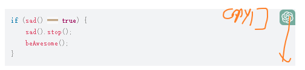

- [X]  Add editor
- [X]  Add Pinned area
- [x] Add Post Gist Method
- [x] Add Delete Gist Method
- [x] Add Update Gist Method
- [x] Add Star Gist Method, pinned is starred
- [x] Add Unstar Gist Method
- [ ] How to deal with the tags?
- [ ] Add Gist Search Method
- [X] Snippet Info Modal
- [ ] Use Gpt3 to generate Title / Filename / Description
- [ ] TimeZone Support(setting)
- [X] show starred gist in editor
- [X] star gist and unstar gist
- [x] write tags and description
- [X] read tags and description
- [X] show tags
- [X] show tags list
- [ ] tags click to search
- [ ] language click to search
- [ ] share gist(url + image)S
- [X] copy gist to clipboard
- [ ] fix fist item can't be starred
- [ ] show description modify modal
- [ ] add run snippet 
- [X] move submit textarea to top
- [X] search desc and filename
- [ ] search data content(put into settings)
- [ ] connect to gpt
- [ ] setting modal
- [ ] help modal
- [ ] use gist to store settings(write a function to create,update settings)
- [ ] use gist to style(so that every can share their style)
- [ ] add copy to code editor mimi 
- [ ] tag editor